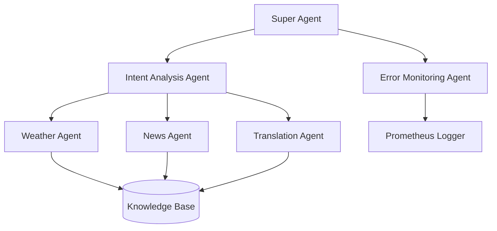

# Multi-Agent AI Orchestration System

## 📘 Overview
This project was developed as part of a 24-hour AI internship challenge. It involves a hierarchical and modular multi-agent system capable of interpreting natural language queries and delegating them to appropriate task agents for execution.

The system architecture is designed for **Kali Linux** and supports **WSL2** compatibility, integrating secure gRPC communication, kernel-assisted agent control, and real-time monitoring using Prometheus.

---

## 📁 Repository Structure
The repository is structured as follows:

```
multi-agent-system/
├── super_agent/
│   └── kagent.so
├── mid_agents/
│   ├── intent/
│   │   ├── parser.py
│   │   └── errors/
│   │       └── __init__.py
│   └── monitoring/
│       └── error_monitor.py
├── task_agents/
│   ├── weather.py
│   ├── news.py
│   └── translation.py
├── shared/
│   ├── config/
│   │   ├── agent_cert.pem
│   │   └── agent_key.pem
│   └── protos/
│       └── agent.proto
├── utils/
│   ├── errors.py
│   └── api_validator.py
├── agent_pb2.py
├── agent_pb2_grpc.py
├── agent_monitor.bpf
├── agent_monitor.c
├── client.py
├── server.py
├── kagent.c
├── prometheus.yml
├── server-cert.pem
├── server-key.pem
└── venv/ (virtual environment)
```

---

## 🧠 Architecture Diagram



### Key Components
- **Super Agent**: Coordinates agents using kernel module and gRPC.
- **Intent Analysis Agent**: Parses user queries using NLP.
- **Error Monitoring Agent**: Tracks system errors and uptime.
- **Task Agents**: Perform weather retrieval, news fetching, and translation tasks.

---

## 🚀 Features Implemented

- ✅ Multi-level agent hierarchy
- ✅ Secure TLS gRPC communication protocol
- ✅ NLP-based intent analysis with validation and fallback
- ✅ Real-time Prometheus monitoring with uptime and error metrics
- ✅ Error handling via custom exception classes
- ✅ Fallback strategies for external API failures
- ✅ Kernel-level support using compiled `kagent.so`
- ✅ CLI client with gRPC query dispatch
- ✅ Windows WSL2 support

---

## 🔧 Setup Instructions (Kali Linux & WSL2)

### Step 1: Clone Repository
```bash
git clone <your-repo-url>
cd multi-agent-system
```

### Step 2: Python Virtual Environment
```bash
sudo apt update
sudo apt install python3-venv python3-dev build-essential -y
python3 -m venv venv
source venv/bin/activate
pip install --upgrade pip
```

### Step 3: Install Python Dependencies
```bash
pip install transformers torch clipspy scapy prometheus_client grpcio grpcio-tools
```

### Step 4: Install System Packages
```bash
sudo apt install linux-headers-$(uname -r) clang llvm libelf-dev gcc-multilib \
libbpf-dev bpftool lxc rsyslog stress-ng hping3 -y
```

### Step 5: eBPF & Kernel Module
```bash
sudo mkdir -p /sys/fs/bpf
sudo mount -t bpf bpf /sys/fs/bpf
sudo bpftool prog load ./agent_monitor.bpf /sys/fs/bpf/agent_monitor

# Compile kernel agent
gcc -o super_agent/kagent.so -shared -fPIC kagent.c
```

### Step 6: Generate Protobuf Bindings
```bash
cd shared/protos
python -m grpc_tools.protoc -I. --python_out=../../ --grpc_python_out=../../ agent.proto
cd ../../
```

### Step 7: TLS Certificates
```bash
openssl req -x509 -newkey rsa:4096 -nodes -out shared/config/agent_cert.pem -keyout shared/config/agent_key.pem -days 365 \
-subj "/C=US/ST=KaliAgents/O=AgentOrchestration/CN=internal-ca"
```

### Step 8: Run the System
```bash
python server.py
python client.py
```

---

## 📡 gRPC API Documentation

### Service: `AgentService`
#### Method: `SendAgentMessage`
```proto
rpc SendAgentMessage(AgentMessage) returns (AgentMessage)
```

#### Request
| Field         | Type              | Description                             |
|---------------|-------------------|-----------------------------------------|
| id            | string            | Message origin (e.g. "cli")             |
| payload       | bytes             | Natural language query (UTF-8 encoded)  |
| urgency       | enum (Urgency)    | NORMAL / ELEVATED / CRITICAL            |
| audit_trail   | repeated string   | Optional trace log                      |

#### Response
| Field   | Type    | Description                      |
|---------|---------|----------------------------------|
| payload | bytes   | Result or explanation string     |

#### Example
```json
{
  "id": "cli",
  "payload": "translate hello to french",
  "urgency": "NORMAL"
}
```

---

## 📊 Monitoring with Prometheus
Metrics available at: `http://localhost:9090/metrics`

### Exposed Metrics
- `agent_uptime_seconds{agent="weather"}`
- `api_error_count{agent="translation"}`

---

> 🛠️ Developed by Pushkar as part of a 24-hour AI Internship Challenge
